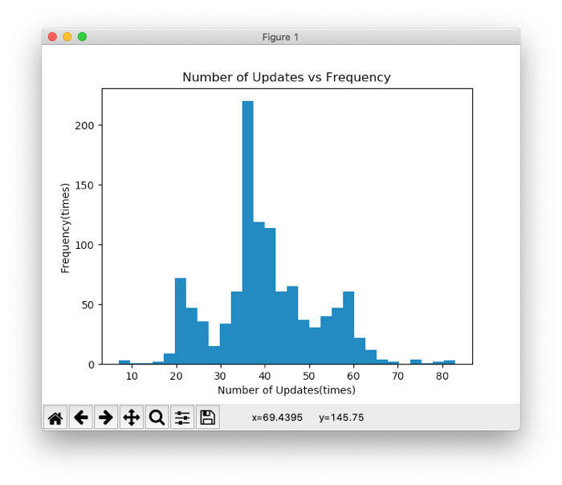
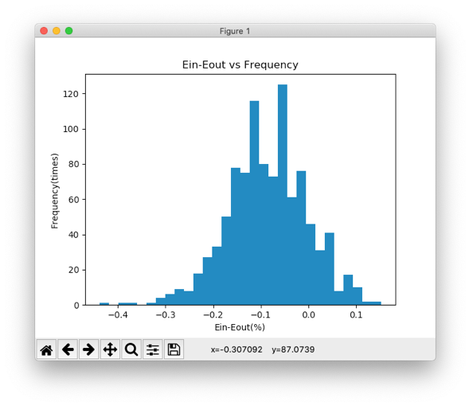
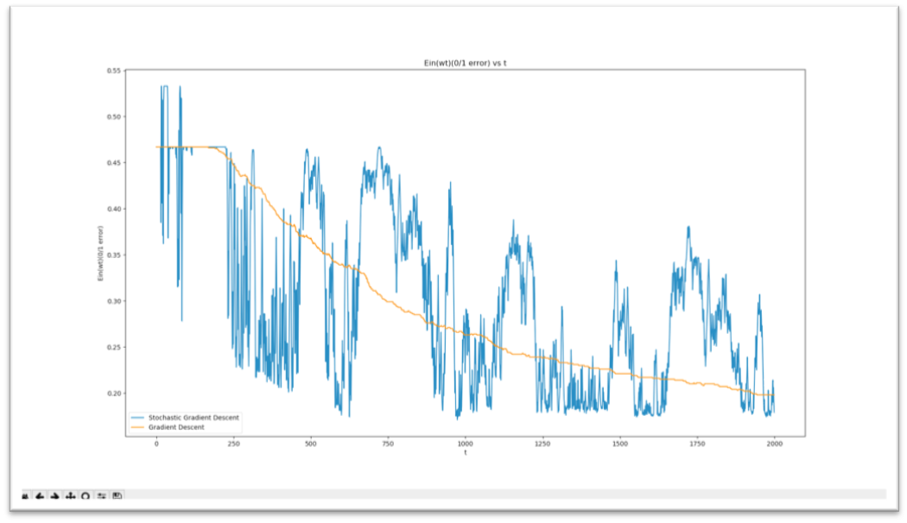

# Machine Learning Foundation & Techniques
Prof. Hsuan-Tien Lin's ML Courses

- [ML Foundation](https://www.csie.ntu.edu.tw/~htlin/course/mlfound19fall/)

- [ML Techniques](https://www.csie.ntu.edu.tw/~htlin/course/mltech18spring/)

### Foundation HW1
```
Lecture 1: The Learning Problem
Lecture 2: Learning to Answer Yes/No
Lecture 3: Types of Learning
Lecture 4: Feasibility of Learning
```

- Programming: PLA & Pocket


### Foundation HW2
```
Lecture 5: Training versus Testing
Lecture 6: Theory of Generalization
Lecture 7: The VC Dimension
Lecture 8: Noise and Error
```

- Programming: Decision Stump


### Foundation HW3
```
Lecture 9: Linear Regression
Lecture 10: Logistic Regression
Lecture 11: Linear Models for Classification
Lecture 12: Nonlinear Transformation
```

- Programming: Logistic Regression
